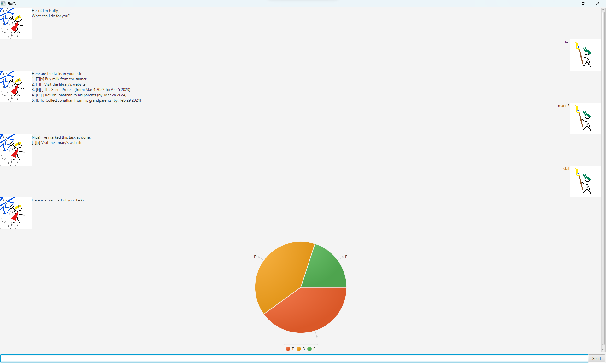

# Fluffy User Guide

[//]: # (Update the title above to match the actual product name)

[//]: # (Product screenshot goes here)


[//]: # (Product description goes here)
Fluffy is a desktop app for managing tasks,
optimized for use via Text Commands while still having the benefits of
a Graphical User Interface (GUI).

If you can type fast, Fluffy can get your task management done faster
than traditional GUI apps 🚀.

## Quick Start

1. Ensure you have Java `11` or above installed in your Computer.
2. Download the latest `fluffy.jar` from [here](https://github.com/drustanyjt/ip/releases)
3. Copy the file to the folder you want to use as the home folder for Fluffy.
4. Double-click the file to start the app. The GUI similar to the picture above should appear in a few seconds.
5. Type away! A list of commands can be found below

## Adding deadlines

[//]: # (Describe the action and its outcome.)
Deadlines are tasks that need to be completed by a certain date.

```
deadline *description* /by *date in yyyy-mm-dd*
```

For example:

```
deadline CS2103T iP /by 2023-03-17
```

This will add a deadline with the description `CS2103T iP`
and the due date `2023-03-17`.

## Adding events

[//]: # (Describe the action and its outcome.)
Events are tasks that occur from a certain time to another.

```
event *description* /from *start date in yyyy-mm-dd* /to *end date in yyyy-mm-dd*
```

For example:

```
event The Lion King Exhibition /from 2024-06-01 /to 2024-06-30
```

This will add an event with the description `The Lion King Exhibition`
and the start date `2024-06-01` and end date `2024-06-30`.

[//]: # (Feature details)

## Adding todos

Todos are tasks that need to be done.

```
todo *description*
```

For example:

```
todo Buy groceries
```

This will add a todo with the description `Buy groceries`.

## Listing all tasks

All tasks can be listed using the `list` command.

```
list
```

Using the above examples, you would see a list of tasks like this:

```
1. [D][ ] CS2103T iP (by: Mar 17 2023)
2. [E][ ] The Lion King Exhibition (from: Jun 1 2024 to: Jun 30 2024)
3. [T][ ] Buy groceries
```

## Marking tasks as done

Tasks can be marked as done using the `mark` command.

```
mark *task number*
```

For example:

```
mark 3
```

This will mark the third task (as it appears in `list`) as done.

## Unmarking tasks as done

Tasks can be unmarked as done using the `unmark` command.

```
unmark *task number*
```

For example:

```
unmark 3
```

This will unmark the third task (as it appears in `list`) as done.

## Deleting tasks

Tasks can be deleted using the `delete` command.

```
delete *task number*
```

For example:

```
delete 3
```

This will delete the third task (as it appears in `list`).

## Finding tasks

Tasks can be found using the `find` command.

```
find *keyword*
```

For example:

```
find Lion
```

This will find tasks with the keyword `Lion` in their description.

## Statistics

Statistics can be viewed using the `stat` command.

```
stat
```

This will show the number of tasks of each type and the number of tasks done,
as a pie chart.

## Exiting the program

The program can be exited using the `bye` command.

```
bye
```

This will close the program.

## Saving the data

Fluffy data is saved in the hard disk automatically after every command.
To locate the data, look for the `fluffy.txt` file in the `data` folder,
which is created in the same directory as the program.

## Cheatsheet of commands

| Action | Format | Examples |
|--------|--------|---------|
| Add deadline | `deadline *description* /by *date in yyyy-mm-dd*` | `deadline CS2103T iP /by 2023-03-17` |
| Add event | `event *description* /from *start date in yyyy-mm-dd* /to *end date in yyyy-mm-dd*` | `event The Lion King Exhibition /from 2024-06-01 /to 2024-06-30` |
| Add todo | `todo *description*` | `todo Buy groceries` |
| List tasks | `list` | `list` |
| Mark task as done | `mark *task number*` | `mark 3` |
| Unmark task as done | `unmark *task number*` | `unmark 3` |
| Delete task | `delete *task number*` | `delete 3` |
| Find tasks | `find *keyword*` | `find Lion` |
| View statistics | `stat` | `stat` |
| Exit program | `bye` | `bye` |

[//]: # (Credits go here)
## Credits

This user guide was written by [Drustan](https://www.linkedin.com/in/drustan/)
and ChatGPT, the AI language model by OpenAI.

